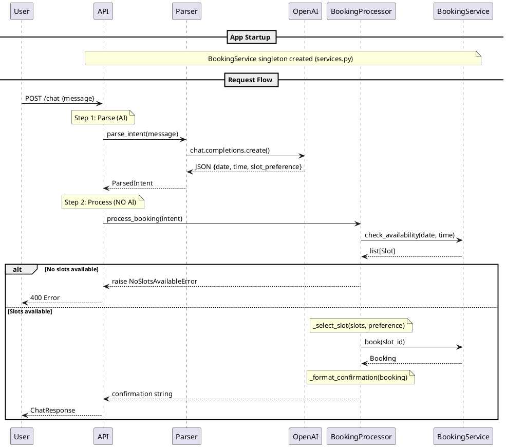

# Pattern A: AI as Service - Sequence Diagram

## Main Entities

| Entity | File | Responsibility | AI Involved? |
|--------|------|----------------|--------------|
| **API** | `api.py` | HTTP endpoint, orchestration, error handling | No |
| **Services** | `services.py` | Singleton BookingService (created at startup) | No |
| **Parser** | `parser.py` | Convert natural language → structured data | **YES (ONLY HERE)** |
| **OpenAI** | external | LLM service | External |
| **BookingProcessor** | `booking.py` | Business logic, slot selection | No |
| **BookingService** | `shared/` | Data layer (availability, booking) | No |

## Data Models (Contracts)

| Model | Purpose | Key Fields |
|-------|---------|------------|
| `ChatRequest` | API input | `message: str` |
| `ParsedIntent` | Parser → Processor | `date`, `time`, `slot_preference`, `raw_message` |
| `Slot` | Service → Processor | `slot_id`, `court`, `date`, `time` |
| `Booking` | Service → Processor | `booking_id`, `court`, `date`, `time` |
| `ChatResponse` | API output | `response: str` |

## Sequence Diagram (PlantUML)



## Simplified Flow (ASCII)

```
User                API                 Parser              OpenAI
  |                  |                    |                    |
  |--POST /chat----->|                    |                    |
  |                  |--parse_intent()--->|                    |
  |                  |                    |--completions()---->|
  |                  |                    |<---JSON response---|
  |                  |<--ParsedIntent-----|                    |
  |                  |
  |                  |                BookingProcessor                BookingService
  |                  |                      |                               |
  |                  |--process_booking()-->|                               |
  |                  |                      |--check_availability()-------->|
  |                  |                      |<------list[Slot]--------------|
  |                  |                      |--book(slot_id)--------------->|
  |                  |                      |<------Booking-----------------|
  |                  |<--confirmation------|
  |<--ChatResponse---|
```
